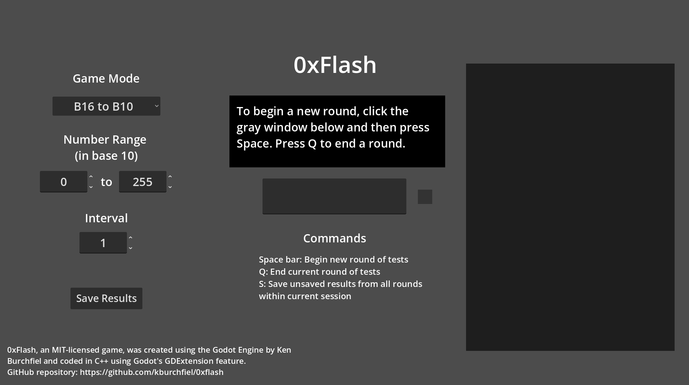
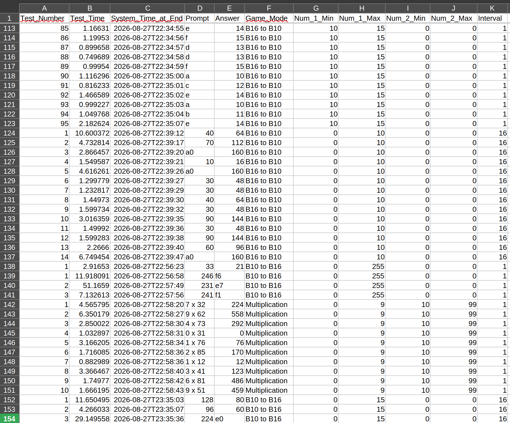

# 0xFlash: A Godot-based game for practicing your decimal-to-hexadecimal skills

[Work in progress]

By Ken Burchfiel

Released under the MIT License

(Note: As with my other repositories at https://github.com/kburchfiel/, I am not using generative-AI tools to create this project.)

## Introduction

0xFlash is a simple game that allows you to practice three different skills:

1. Converting hexadecimal numbers like 7e to decimal ones like 126

1. Converting decimal numbers to hexadecimal ones

1. Multiplying two numbers

There are also special modes (designated with an (x16) value within the dropdown menu) that allow you to test yourself on multiples of 16, which can prove useful when learning how to quickly convert from a decimal number to a 2-digit hexadecimal number and back. (After all, a 2-digit hexadecimal number, in decimal form, is simply (1) 16 times a number between 0 and 15 plus (2) a value between 0 and 15.)

The game allows you to set the difficulty level for a given mode by determining the smallest- and largest-possible values that will be chosen for each test. 

In addition, pressing 's' outside of a test will save your results to a .csv file, thus making it easier to keep track of and analyze your progress. Here's what these results look like within LibreOffice Calc:

## Development notes

This game is coded entirely in C++ using Godot's GDExtension feature. (Using C++ probably doesn't provide much, if any performance benefit, but I saw it as a great opportunity to further building my GDExtension skills.)

I made frequent reference to my [Godot C++ 3D tutorial](https://github.com/kburchfiel/godot_cpp_3d_tutorial) when putting this game together, though this project also includes a number of concepts not present within that game. You may find the C++ 3D tutorial to be helpful as well, even if your game (like 0xFlash) is 2D-based.

## To-dos (incomplete list)

1. Update your UI code so that (1) all number-2-related items (including labels) are not shown unless the Multiplication mode is pressed and (2) 'Number 1 range' is changed to 'Number range' when modes other than Multiplication are chosen.

1. Figure out which additional variables can be made `const`.

1. Add more within-game instructions, perhaps via a standalone window that can be toggled on and off via a button.