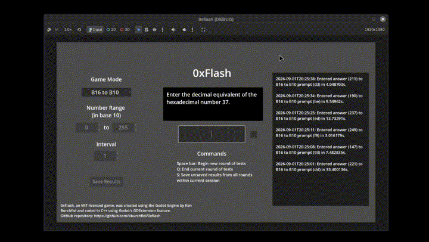

# 0xFlash: A Godot-based game for practicing your decimal-to-hexadecimal and multiplication skills

By Ken Burchfiel

Released under the MIT License

(Note: As with my other repositories at https://github.com/kburchfiel/, I am not using generative-AI tools to create this project.)

**To download pre-compiled Linux or Windows releases of this game, visit its itch.io page at https://kburchfiel.itch.io/0xflash .**

## Gameplay Instructions

0xFlash is a simple game that allows you to practice three different skills:

1. Converting hexadecimal numbers like 7e to decimal ones like 126 *(Game mode: B16 to B10)*

1. Converting decimal numbers to hexadecimal ones *(Game mode: B10 to B16)*

1. Multiplying two numbers *(Game mode: Multiplication)*

### Configuring a round

You can choose your desired mode via the 'Game Mode' dropdown menu on the top left. The game also allows you to set the difficulty level for a given mode by determining the smallest- and largest-possible values that will be chosen for each test. 

For the hexadecimal <-> decimal game modes (B16 to B10 and B10 to B16), you can also choose a custom interval for your prompts. For instance, selecting a number range of 0 to 15, along with an interval of 16, will let you test yourself on the multiples of 16 ranging from 0 to 240 (15x16), which can prove useful when learning how to quickly convert from a decimal number to a 2-digit hexadecimal number and back. (After all, a 2-digit hexadecimal number, in decimal form, is simply (1) 16 times a number between 0 and 15 plus (2) a value between 0 and 15.)

### Playing the game

Once you begin a round (by pressing Space within the gray response box at the center of the window), you'll be presented with a continuous series of tests. Once you enter the correct answer for a prompt, the gray square to the right of the response box will flash green; the response box will get cleared out; and a new prompt will appear. (You don't need to press Enter after writing your response; the game will recognize a correct answer right away.) Once you're finished with a round, simply press Q to quit.

### Storing your results

Pressing 'S' outside of a test (or clicking the Save Results button) will save your results to a .csv file, thus making it easier to keep track of and analyze your progress. The actual location of this file will vary between operating systems. On Linux, you should be able to find it at:

`/home/<your_username>/.local/share/godot/app_userdata/0xflash/0xflash_results.csv`

And on Windows, it should be available at:

`APPDATA%\Godot\app_userdata\0xflash\0xflash_results.csv`

Here's what these results look like within LibreOffice Calc:

At some point, I plan to create a separate Python script that will allow you to analyze and visualize your progress for each game mode.

## Development notes

This game is coded entirely in C++ using Godot's GDExtension feature. (Using C++ probably doesn't provide much, if any performance benefit, but it was nevertheless a great opportunity to further building my GDExtension skills.)

I made frequent reference to my [Godot C++ 3D tutorial](https://github.com/kburchfiel/godot_cpp_3d_tutorial) when putting this game together, though this project also includes a number of concepts not present within that game. You may find the C++ 3D tutorial to be helpful as well, even if your game (like 0xFlash) is 2D-based.